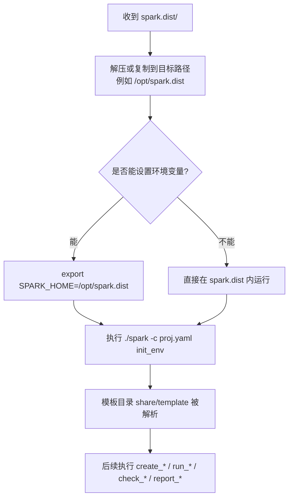
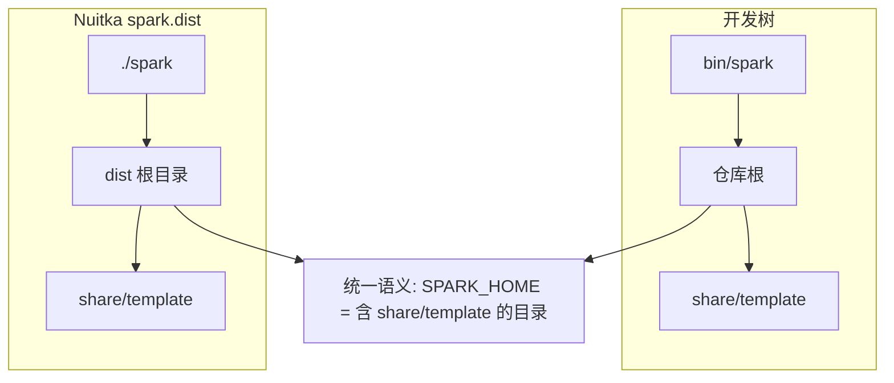
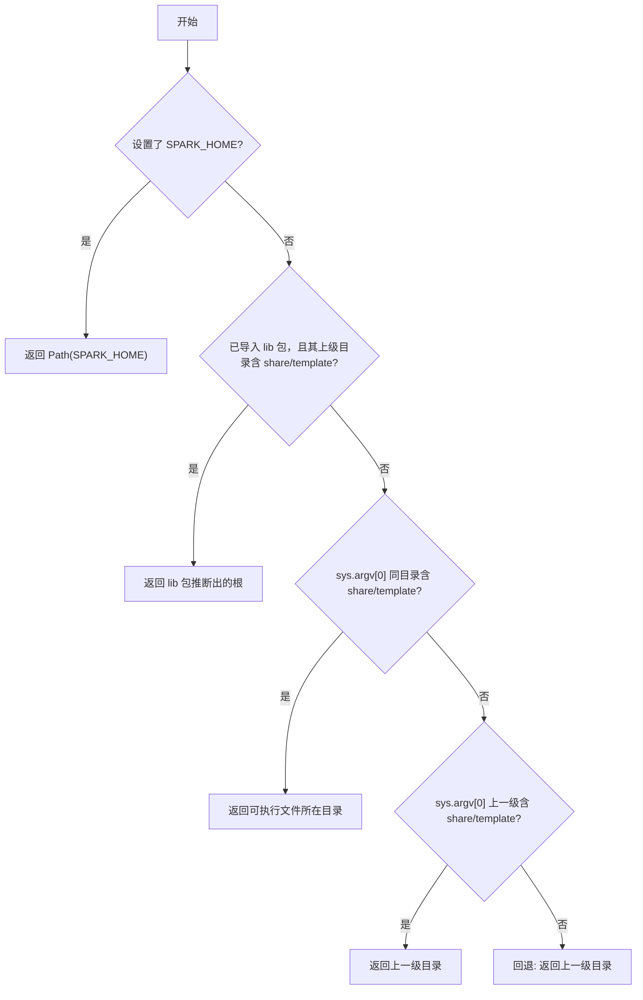
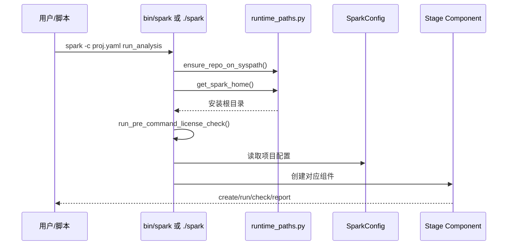
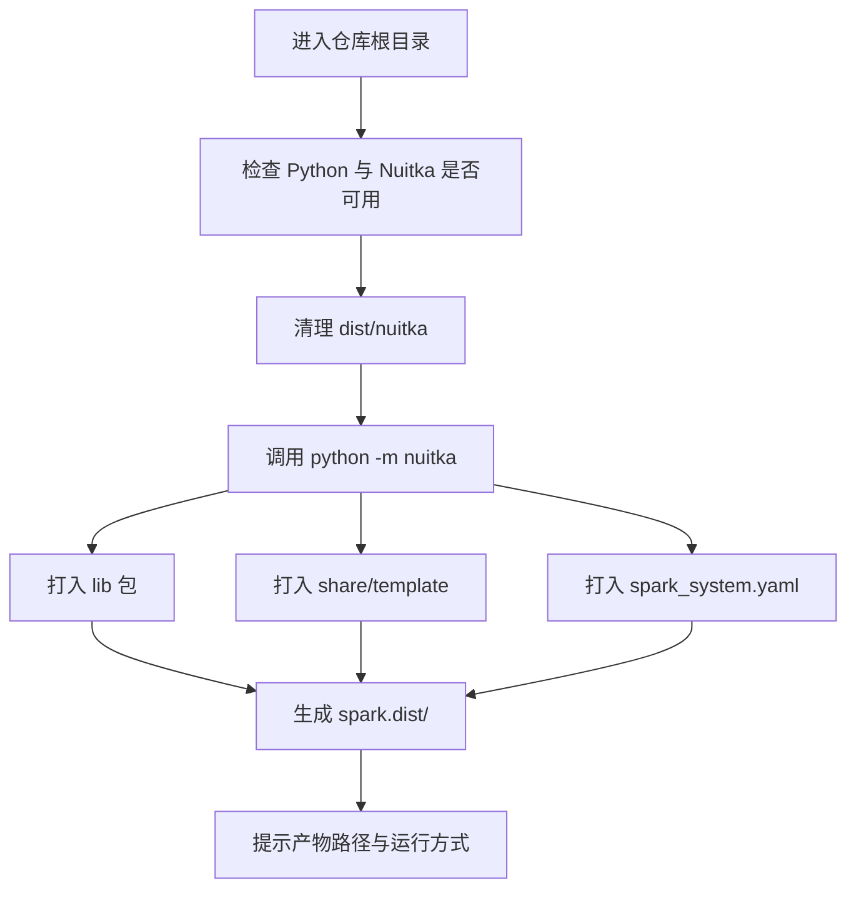
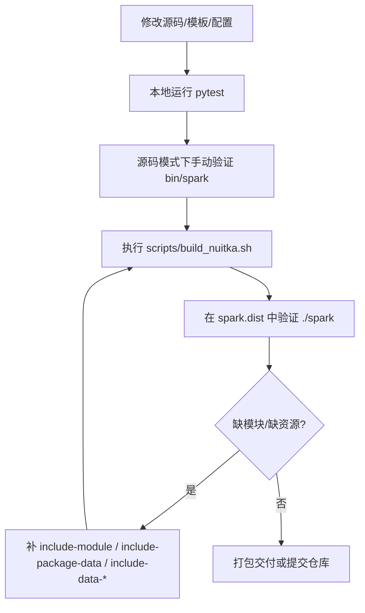
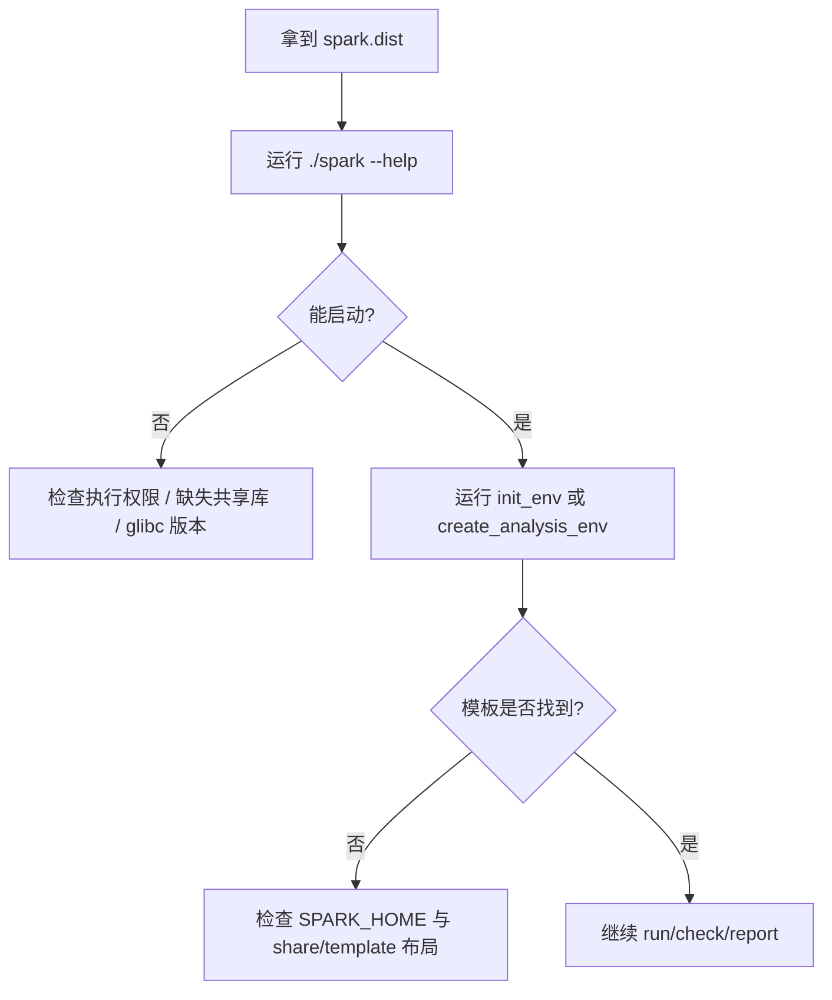
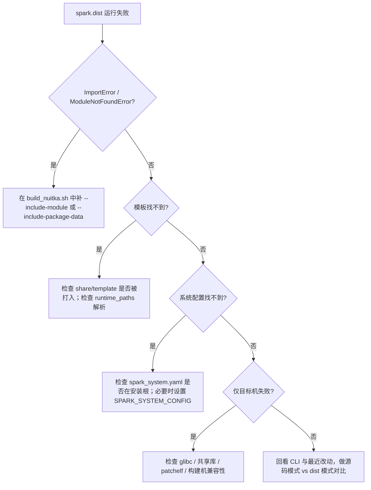

# Nuitka 二进制发行（Linux / one-folder）

本文档面向两类读者：

- **最终用户 / 部署人员**：希望拿到 `spark.dist` 后直接运行，不必安装 Python。
- **开发者 / 维护者**：希望理解打包布局、路径解析、调试方法，以及后续如何迭代 `build_nuitka.sh`。

目标是在 **与目标机相同或更旧的 Linux x86_64** 上，用 Nuitka **`--standalone`** 生成 **单目录发行包**。产物目录内包含 Python 运行时与依赖，用户只需拿到整个目录即可运行 `spark`。

---

## 一图看懂整体流程


这张图对应两条主线：

- **构建主线**：源码仓库 -> Nuitka 打包 -> `spark.dist`
- **使用主线**：解压目录 -> 设置环境变量（可选但推荐）-> 运行 `spark`

---

## 用户视角：我应该怎么使用

如果你是使用者，只需要记住三件事：

1. 拿到的是一个目录，例如 `spark.dist/`，不是单一二进制文件。
2. 运行时尽量把 **`SPARK_HOME`** 指向这个目录。
3. 保持 `spark`、`share/template/`、`spark_system.yaml` 在同一安装根语义下。

### 用户使用流程图



### 最小操作示例

```bash
tar -xzf spark-dist.tar.gz -C /opt
export SPARK_HOME=/opt/spark.dist
/opt/spark.dist/spark -c /data/proj.yaml init_env
/opt/spark.dist/spark -c /data/proj.yaml create_analysis_env
/opt/spark.dist/spark -c /data/proj.yaml run_analysis
```

### 用户验收清单

- `./spark --help` 能正常输出帮助。
- `share/template/` 目录存在，且模板文件齐全。
- `spark_system.yaml` 可随发行包一同分发，或通过 `SPARK_SYSTEM_CONFIG` 指向外部路径。
- 即使未设置 `SPARK_HOME`，在 `spark.dist/` 目录中直接运行 `./spark` 也能工作。

---

## 开发者视角：为什么这样设计

Spark 既支持**源码运行**，也支持 **Nuitka one-folder** 运行。为了让两种模式都能找到模板与系统配置，项目把“安装根”统一定义为：

> **包含 `share/template` 的那一层目录**

运行时由 `lib/core/runtime_paths.py` 中的 `get_spark_home()` 负责解析。

### 目录结构对照（开发树 vs 发行目录）

#### 开发树（源码仓库）

```text
Altas/                          <- 仓库根 = SPARK_HOME
|-- bin/
|   `-- spark                   <- 入口脚本；其上一级含 share/template
|-- lib/
|-- share/
|   `-- template/
|-- spark_system.yaml
`-- ...
```

#### Nuitka one-folder（`spark.dist`）

```text
spark.dist/                     <- 发行根 = SPARK_HOME
|-- spark                       <- Nuitka 生成的可执行文件
|-- share/
|   `-- template/               <- 与 spark 同层，由构建脚本打入
|-- spark_system.yaml
`-- ...                         <- 运行时、.so、内嵌包、依赖库
```

### 布局统一关系图



---

## 运行时路径解析细节

`get_spark_home()` 的设计目标是：

- **显式配置优先**
- **测试环境与源码运行可靠**
- **Nuitka 发行目录无需额外适配**

### `get_spark_home()` 判定流程



### 为什么要先看 `lib` 包路径

在 `pytest`、`python -c`、IDE 调试等场景里，`sys.argv[0]` 常常不是 `bin/spark`。如果只靠 `sys.argv[0]`，模板目录可能会被错误推断。因此当前顺序是：

1. `SPARK_HOME`
2. 从 `lib` 包位置推断
3. 可执行文件同目录
4. 可执行文件上一级

这样能同时兼容：

- `source spark.csh` 后的生产环境
- 仓库根直接开发与测试
- Nuitka 发行目录

### CLI 启动路径关系图



---

## 构建依赖

| 类别 | 说明 |
|------|------|
| Python | 3.9+，建议与目标机兼容的版本 |
| 系统包（Debian/Ubuntu 示例） | `python3-dev`、`build-essential`、`patchelf` |
| pip 包 | `requirements.txt` + `nuitka`、`ordered-set`、`zstandard` |

```bash
sudo apt install -y python3-dev build-essential patchelf
pip install -r requirements.txt
pip install nuitka ordered-set zstandard
```

### 推荐构建环境

- 尽量在**接近目标机**的发行版/容器上构建。
- 如果目标机较旧，优先在**更旧的 glibc 环境**中构建，以避免兼容性问题。
- 建议使用干净虚拟环境，减少“开发机上能打包，交付机上不能运行”的偶发现象。

---

## 构建步骤

```bash
cd /path/to/Altas
python3 -m venv .venv
source .venv/bin/activate
pip install -r requirements.txt
pip install nuitka ordered-set zstandard

chmod +x scripts/build_nuitka.sh
./scripts/build_nuitka.sh
```

默认产物目录为 **`dist/nuitka/spark.dist/`**。如果 Nuitka 在当前版本下输出目录名有变化，请以 `dist/nuitka/` 中的实际结果为准。

### 构建脚本执行流程图



### `scripts/build_nuitka.sh` 在做什么

| 选项 | 作用 |
|------|------|
| `--standalone` | 生成单目录分发包 |
| `--output-dir=dist/nuitka` | 指定产物根目录 |
| `--output-filename=spark` | 生成的入口文件名为 `spark` |
| `--include-package=lib` | 打入业务代码包 |
| `--include-package-data=jinja2` | 保留 Jinja2 运行所需资源 |
| `--include-data-dir=share/template=share/template` | 打入模板目录 |
| `--include-data-files=spark_system.yaml=spark_system.yaml` | 打入系统配置 |
| `--nofollow-import-to=pytest` | 不把测试框架一起打入产物 |
| `bin/spark` | 以 CLI 入口为打包起点 |

---

## 从源码到发行包：开发者维护流程

### 日常迭代流程图



### 适合纳入打包验证的变更

以下改动后，建议至少重新做一次 `spark.dist` 冒烟测试：

- `bin/spark`
- `lib/core/runtime_paths.py`
- `lib/core/template_engine.py`
- `share/template/`
- `spark_system.yaml`
- 新增依赖，如 `cryptography`、Jinja2 扩展、动态加载模块

---

## 用户交付建议

### 推荐交付内容

```text
spark.dist/
|-- spark
|-- share/template/
|-- spark_system.yaml
`-- ... 其余 Nuitka 运行文件
```

### 推荐交付方式

- 直接分发整个 `spark.dist/` 目录
- 或打成 `tar.gz` 后分发，再在目标机解压

```bash
tar -czf spark-dist.tar.gz -C dist/nuitka spark.dist
tar -xzf spark-dist.tar.gz -C /opt
export SPARK_HOME=/opt/spark.dist
/opt/spark.dist/spark -c /data/proj.yaml init_env
```

### 不建议的做法

- 只拷贝 `spark` 可执行文件，漏掉旁边的依赖目录
- 手动移动 `share/template/` 到其他位置但不设置 `SPARK_HOME`
- 在比目标机更新很多的系统上构建，再拿到旧系统直接运行

---

## 验证与排障

### 用户侧快速验证流程图



### 开发者排障流程图



### 验证清单

1. `python -m pytest tests/ -q` 通过。
2. `python bin/spark -c test_work/proj.yaml init_env` 能在源码模式下工作。
3. `dist/nuitka/spark.dist/spark --help` 能启动。
4. 在 `spark.dist/` 目录中未设置 `SPARK_HOME` 也能解析模板目录。
5. 设置 `SPARK_HOME` 后仍能正常运行，确保显式配置优先级不被破坏。

单元测试中与路径逻辑直接对应的文件是 `tests/test_runtime_paths.py`。

---

## 常见问题

- **`cryptography` 相关 ImportError**：按报错在 `build_nuitka.sh` 中追加 `--include-module=...` 或 `--include-package-data=cryptography`。
- **glibc 不兼容**：尽量在更旧或与目标机一致的系统中构建。
- **csh / EDA 工具不存在**：这些工具不在 Nuitka 包内，目标系统仍需准备好外部 EDA 环境。
- **只在 pytest 里表现正常，dist 模式异常**：优先检查是否漏打入 `share/template/`、`spark_system.yaml` 或第三方资源文件。
- **为什么 `SPARK_HOME` 仍保留优先级**：因为生产环境常通过 `source spark.csh` 或外部部署脚本显式设置安装根，这比任何自动推断都更稳定。

---

## 与其他文档的关系

- 如果你关注**如何使用 Spark 命令**，先读 `share/doc/USER_GUIDE.md`
- 如果你关注**如何新增阶段、扩展模块**，先读 `share/doc/DEVELOPER_GUIDE.md`
- 如果你关注**Nuitka 打包与交付**，优先读本文

---

## 相关代码位置

- 路径解析实现：`lib/core/runtime_paths.py`
- CLI 入口：`bin/spark`
- 模板加载：`lib/core/template_engine.py`
- 构建脚本：`scripts/build_nuitka.sh`
- 路径测试：`tests/test_runtime_paths.py`
