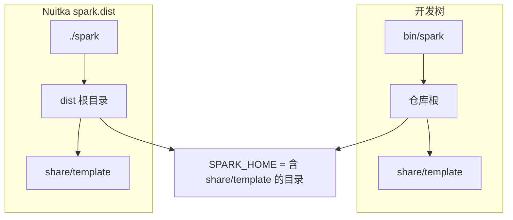
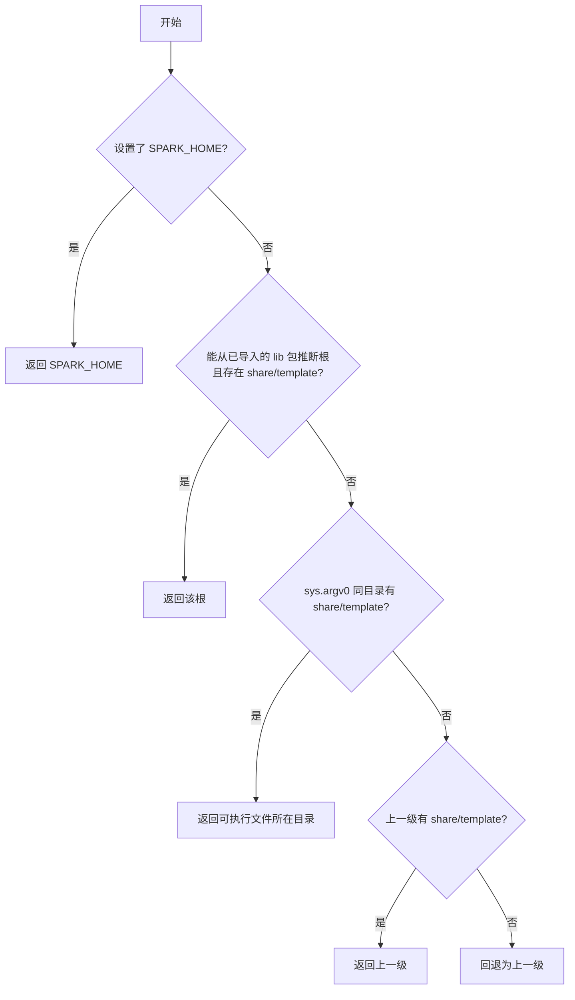

# Nuitka 二进制发行（Linux / one-folder）

在 **与目标机相同或更旧的 Linux x86_64** 上，用 Nuitka **`--standalone`** 打出 **单目录发行包**：内含 Python 运行时与依赖，用户无需单独安装 Python 即可运行 `spark`。

---

## 目录结构对照（开发树 vs 发行目录）

两种布局下，**安装根**（下文记为 `SPARK_HOME`）都是「含有 `share/template` 的那一层」。程序通过 `lib/core/runtime_paths.py` 中的 `get_spark_home()` 统一解析。

### 开发树（源码仓库）

```text
Altas/                          ← 仓库根 = SPARK_HOME
├── bin/
│   └── spark                   ← 入口脚本；上一级含 share/template
├── lib/
├── share/
│   └── template/
├── spark_system.yaml
└── ...
```

### Nuitka one-folder（`spark.dist`）

```text
spark.dist/                     ← 发行根 = SPARK_HOME（与可执行同层）
├── spark                       ← Nuitka 生成的可执行文件
├── share/
│   └── template/               ← 与 spark 同目录，由构建脚本打入
├── spark_system.yaml
└── ...                         ← 运行时、.so、内嵌 lib 等由 Nuitka 放置
```

下图概括两种布局与「安装根」的关系（GitHub 上可渲染 Mermaid）：



---

## `get_spark_home()` 解析顺序

运行时按以下顺序决定安装根（与代码一致；**`SPARK_HOME` 始终最优先**）：



说明要点：

- **`source spark.csh` 并设置 `SPARK_HOME`**：生产环境推荐，与模板里 **`SPARK_TMPL`** 等变量一致。
- **从 `lib` 包推断**：适合 `pytest`、`python -c` 等入口（此时 `sys.argv[0]` 往往不是 `bin/spark`）。
- **可执行文件旁 `share/template`**：对应 Nuitka 将数据文件打到与 `spark` 同层目录的布局。

---

## 构建依赖

| 类别 | 说明 |
|------|------|
| Python | 3.9+，建议与目标机兼容的版本 |
| 系统包（Debian/Ubuntu 示例） | `python3-dev`、`build-essential`、`patchelf` |
| pip | `requirements.txt` + `nuitka`、`ordered-set`、`zstandard` |

```bash
sudo apt install -y python3-dev build-essential patchelf
pip install -r requirements.txt
pip install nuitka ordered-set zstandard
```

---

## 构建步骤

```bash
cd /path/to/Altas
python3 -m venv .venv && source .venv/bin/activate
pip install -r requirements.txt
pip install nuitka ordered-set zstandard

chmod +x scripts/build_nuitka.sh
./scripts/build_nuitka.sh
```

默认产物目录为 **`dist/nuitka/spark.dist/`**（以 Nuitka 实际输出为准；若名称不同，以 `dist/nuitka/` 下目录为准）。

### `scripts/build_nuitka.sh` 在做什么（摘要）

| 选项 | 作用 |
|------|------|
| `--standalone` | 单目录分发，自带解释器与依赖 |
| `--include-package=lib` | 打入业务包 |
| `--include-package-data=jinja2` | Jinja2 资源文件（部分环境需要） |
| `--include-data-dir=share/template=...` | 模板目录与可执行同层布局 |
| `--include-data-files=spark_system.yaml=...` | 系统配置文件 |
| `--nofollow-import-to=pytest` 等 | 减小体积、避免测试框架被打入 |

---

## 运行与交付示例

```bash
# 打包整个目录交付（示例）
tar -czf spark-dist.tar.gz -C dist/nuitka spark.dist

# 目标机解压
tar -xzf spark-dist.tar.gz -C /opt

# 推荐：与 csh 环境一致
export SPARK_HOME=/opt/spark.dist
/opt/spark.dist/spark -c /data/proj.yaml init_env
```

---

## 验证清单（可选）

1. **`./spark --help`** 或等价子命令能启动。
2. **`$SPARK_HOME/share/template`** 存在且含预期 `.j2` 模板。
3. **`spark_system.yaml`** 与 `spark` 同层或在 `SPARK_HOME` 下可被找到（依你的配置方式）。
4. 在**未**设置 `SPARK_HOME` 时，从 `spark.dist` 目录直接运行 `./spark`，仍能解析到正确模板目录（依赖「可执行旁 `share/template`」分支）。

单元测试中路径逻辑见：`tests/test_runtime_paths.py`。

---

## 常见问题

- **`cryptography` 相关 ImportError**：在 `build_nuitka.sh` 中按报错追加 `--include-module=...` 或 `--include-package-data=cryptography`。
- **glibc**：构建机的 glibc **不要高于**目标机不支持的版本；必要时在偏旧的目标镜像或容器中构建以扩大兼容性。
- **csh / EDA 工具**：不在 Nuitka 包内，目标系统仍需自行安装 Cadence/Synopsys 等环境与 `csh`。
- **跨平台**：本文档针对 **Linux x86_64**；Windows 上构建脚本需单独适配，不在当前脚本范围内。

---

## 相关代码与文档

- 路径解析实现：`lib/core/runtime_paths.py`
- 入口脚本：`bin/spark`
- 仓库根英文说明中的文档索引：`README.md`
